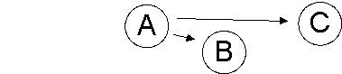
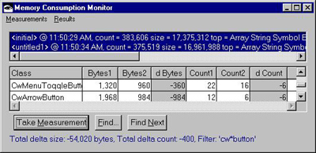
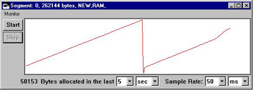

## Introduction
**NOTE:** The following is a cleaned up and reformatted version of the [original article](https://web.archive.org/web/20010712222142/http://www-4.ibm.com/software/ad/smalltalk/discussion/2000/april/dev0400.html) by *Dan Kehn* in April 2000 published in the **Eye on Programming** magazine.


# Smalltalk Dynamic Memory Consumption Analysis

Ah, my reflections on the carefree moments of youth. This is what gives vigor to this month's article.

Certainly these reflections include delegation (denial?) of responsibility--and the pursuit of this should intrigue today's object-oriented developer. Nowhere else is this better epitomized than in the simplicity of Smalltalk's memory management. And in harsh contrast, who among us has not suffered in our pre-Smalltalk days of the tiresome chore of managing memory?

> _"How you design and architect your application affects the way that memory is used. But there are also subtle implementation details that can produce inefficiencies."_ 


Or even worse, having to find the cause behind errant references? I could wax eloquently on the past joys (?) of debugging memory exceptions, but instead, let's focus on the potential foibles that occasionally introduce themselves into our otherwise idyllic environment.

_"There is no such thing as a free lunch."_ Indeed, it is sobering news that while Smalltalk relieves us in great part of the burden of memory management, we are nonetheless well advised to consider some of the more subtle points of our nearly carefree programming world. This article will focus on these issues, hopefully giving you a good flavor for Smalltalk's memory management scheme. That said, let's lay some groundwork, starting necessarily with terminology.

As an aside, when I was a youngster growing up in Ohio, one of my small delights was looking for the toys included in boxes of cereal. I admit that I often dug down to the bottom as soon as I opened the box. In remembrance of this fleeting moment of childhood, I am including a special surprise at the bottom of this article. Do not feel ashamed if you skip directly [there](http://www-4.ibm.com/software/ad/smalltalk/discussion/2000/april/dev0400.html#surprise).

## Terminology

Now onto more serious business. Note that a few of these definitions were borrowed directly from the _IBM Smalltalk User's Guide & Reference._

### Virtual Machine (VM)
The program that provides the execution environment on a single machine. It maps data and logic to the executing machine architecture, isolating the application code from the architecture of the machine. Smalltalk and Java both provide virtual machines in which to run their environment. Their capacities are similar.

### Garbage Collection
The process of recovering memory by collecting only those objects that are still referenced and thereby reclaiming the memory previously occupied by unreferenced objects. This is one of the responsibilities of the virtual machine, and the primary focus of this article.

The principle of Smalltalk's memory reclamation scheme is based on the observation that objects have a bi-modal distribution of lifespans. There are many objects that "die" very young, and some that live to a ripe old age. So two approaches are employed: _scavenging_ to reclaim short-lived objects and _global garbage collection_ ("using the mark and sweep" algorithim) to reclaim long-lived objects. These techniques are collectively called _garbage collection_ in the VisualAge documentation, but the more precise term is _generational scavenging_.

### New Space
Memory area for newly created objects. New space consists of two memory segments. The system uses one segment at a time. When the system conducts a scavenge, it copies only those objects that are still in use to the idle memory segment. Then, it begins using the idle segment and stops using the other segment.

### Scavenge
A rapid technique of manipulating new space in order to recover unused memory by copying only referenced objects into another segment of new space memory, making the prior segment available for additional allocations. Also sometimes called a "flip", since referenced objects are "flipped" from the previously active segment to the new active segment. This recovery technique is optimal in the case where there are many short-lived objects and few long-lived objects. A second technique, to be described shortly, addresses the reclamation of memory previously occupied by long-lived objects.

Traditionally, objects are shown in an ethereal space, inexplicably as rounded figures surrounded by some combination of lines, arrows, etc., for example:



But in harsh reality, Smalltalk objects are not circular. In fact, I have seen them up-close, and I can assure you that they are rectangular. :-)  
And they are not floating in space, but are packed tightly one-against-another, like this:

  
  
For the sake of this example, let's assume that B and C are byte subclasses, like String, consequently they only reference primitive objects, instances of Character.

When the garbage collector performs a scavenge, it simply starts from the top of the new space and copies the referenced objects. In the example above, A references B and C, but the latter do not reference any objects via a pointer. Sadly, B and C cannot assure their own perpetuation into the active new space, for only a reference to them can accomplish this. Hence the importance of class type, that is, bytes subclasses versus pointer subclasses, since the former cannot reference other instances. This "instance shape" designation is stored in the header of each object in order that its references, if present, can be handled properly by the garbage collector.

Note: Instances of classes have one of several possible shapes: bytes, words, longs, and pointers. The scavenge algorithm only needs to be concerned with the pointer-type classes, since non-pointer classes will be copied into the active new space only if they are referenced by pointer-type instances.

In summary, the scavenge simply traverses a list of "structures" (objects), copying its referenced "structures" (objects), the references of the references, and so on. The execution stacks of each process are treated in the same manner in new space, thus they are, in a manner of speaking, the "root" objects of the new space. That is, the execution stacks with their local variables and the like are included during a scavenge, and this traversal entrains all the other referenced objects.

### Old Space and Tenuring
In order to avoid unnecessarily copying the same object again-and-again, it can be promoted into a segment of memory that does not participate in scavenges. This type of memory segment is called an _old space_ (or "tenured space"). One way an object gets tenured is by surviving a series of scavenges. At that point, the VM assumes the object will be present for a long time and thus tenures it into old space. Additionally, an object can be tenured if an existing tenured object references it. For example, since all classes are by definition long-lived, their class and class instance variable references are long-lived. Thus setting a class variable in a given class can result in the promotion of the referenced object into the tenured space. The system reclaims long-lived objects when it does global garbage collections, using a technique to be described shortly.

### Fixed Space
Stores designated objects that the system cannot move by a garbage collection because their memory addresses have been passed to the operating system.

### Weak and Strong References
In the example above, A references B and C. By default, references are strong references. That is, they imply that the memory used by the referenced objects cannot be recovered until the referencing objects themselves are garbage collected, or all references are broken (set to nil). By contrast, a weak reference implies that the memory used by the referenced object can be recovered if all remaining references to it are weak.

How does the VM handle weak references? Returning to our example, object A can optionally mark its references as weak, telling the garbage collector to ignore the fact that it is a pointer-type. This information is recorded in a bit field of the object's header. The weak object designation adds negligable overhead to the scavenging algorithm.

This point is further elaborated in the comments of `Object>>#makeWeak:` 
> _"A weak object is processed specially by the garbage collector. When the garbage collector encounters a weak object, it may nil out any pointer slots in the receiver if the slot is the only remaining reference to the referenced object. When the slot is nil'ed, the weak object, the removed pointer and the_ _#instVarAt:_ _index is placed into the system finalize queue if there is enough room. The finalize queue is processed from Smalltalk (see_ _Processor>>#finalizeCycle__). Note, if the finalize queue is empty, the slot is not nil'ed and the removal of the object is deferred until the next cycle."_

This brings us to the next related term.

### Finalization
Optionally, an object may choose to be notified just before its memory will be reclaimed. This process is known as finalization and is commonly employed in conjunction with weak objects. For example, an object that encapsulates a system resource can be notified that its memory is being reclaimed so it can free related non-Smalltalk resources.

An object can send the `#addToBeFinalized` or `#onFinalizeDo:` message in order to be notified. Note that the finalization of an object is aborted if a new reference is created during the finalization notification. In other words, it is possible that an object will be finalized multiple times. This fact can be helpful should you want to create a cache with a least-used algorithm using finalization as a manner of "aging" the members of the cache.

### Global Garbage Collection
The scavenge technique, while quite efficient, is not without weaknesses. In particular, it does not reclaim long-lived objects in old space. Thus when a scavenge fails to liberate more memory, the next step is to try to eliminate unreferenced objects from old space. This requires a more thorough approach, called a "mark and sweep". In this case, all objects in the old space segments are traversed, starting with the references of the root objects, that is, the execution stacks of all processes and consequently those objects referenced by the system dictionary, _Smalltalk_. As each object is accessed, it is marked as "visited". A second sweep is then made over each old space segment, adding the memory of the unvisited objects to an available list and removing the "visited" mark for the next time from those objects that survived the sweep.

This recovered memory is then reused, or if necessary, the visited objects in the old space are moved into these liberated areas to effectively compress old space and thereby create larger contiguous spaces. If there are no survivors in the old space segment, the memory is relinquished to the operating system. If a global garbage collect fails to free enough memory, another memory segment is allocated.

### Memory Leaks

The term "memory leak" surely originates from traditional environments where memory is referenced by address pointers. Since pointers in this sense do not exist in Smalltalk, "memory leak" is a bit of a misnomer because memory references can never be truly lost. Nonetheless, the term is retained for historical reasons. This remark applies to my car keys as well, which have, to the best of my knowledge, never been truly lost.

While traditional environments have the trouble of memory not being freed, or worse, making references to freed memory, only the former problem is a concern for Smalltalk developers. Of course, in the majority of cases, given correctly written code, the developer can leave the memory management task entirely to the VM without additional tuning. However, if the developer inadvertently leaves a dangling reference, memory will not be freed. And since object-oriented designs tend towards matrix-like relationships, a single errant reference can produce an enormous community of "permanent residents". The ubiquitous nature of these relationships also makes it difficult to find the erroneous reference, creating a modern-day equivalent of the "needle in the haystack" problem.

Fortunately, this sort of problem occurs infrequently. But perhaps as a consequence, tracking tools that are tuned to this task are relatively few in the object-oriented community. In my experience, the popular techniques for finding errant references fall into two categories. I call them the "path tracing" and the "path elimination" techniques.

Let's consider a simple example:

```smalltalk
OrderedCollection new addDependent: Transcript
```

### Path tracing
Here we have created a reference in the class variable of Object, called Dependents. This relationship must be explicitly broken with the #removeDependent: method, otherwise the memory of the target of the dependence will not be reclaimed. Ignoring the fact that these methods are throwbacks from the original implementation of Smalltalk, how do we detect the original omission? The first approach, "path tracing", advocates a series of inspector "Browse References", starting with the original object that is not being relinquished. After several references-of-references attempts, the inspector shows an Association instance like this:

```smalltalk
'Dependents' -> IdentityDictionary(OrderedCollection(an EtTranscript))
```

At this point, hopefully a small light bulb goes off in the developer's head and they say, "Hmm-m, maybe there is an errant reference in the Dependents dictionary of Object". Depending on the amount of time this hypothetical developer had spent trying to find the cause of the problem, this may not be their exact words, but you get the idea.

### Path elimination
The causes of other memory leaks are of a similar nature, that is, failing to break a reference from a long-lived object to a shorter-lived object. Often these objects are part of a notification mechanism. For example, VisualAge itself relies heavily on the notification scheme defined in the `AbtObservableObject` hierarchy and redefined as an extension in the Object hierarchy by the `AbtCLDTAdditions` application. `AbtCLDTAdditions` includes a class variable, `AbtEventDependents`, which fulfills the same role as the Dependents dictionary above--and presents the same potential pitfall. The graphics subsystem of base Smalltalk, CommonWidgets, has similar mechanisms, created by methods like `#addCallback:receiver:selector:clientData:` and `#addEventHandler:receiver:selector:clientData:`. These implementations, however, differ notably from Object's `#addDependent:` / `#removeDependent:` implementation in that they automatically break the dependency when the observed object (part) or widget is destroyed. Subsequently, it is only under unusual circumstances that the developer can mistakenly create an unbroken reference directly attributable to a part or widget. It is nonetheless possible, for example, by creating a dependency from an outer scope long-lived object to a short-lived object, as shown below:

```smalltalk
self parent  
    addEventHandler: XmNexposeCallback  
    receiver: self  
    selector: #myParentWasExposed:clientData:callData:  
    clientData: nil.
```

In this contrived example, "self" is a child widget that wants to be notified when its parent repaints. The code above stores the dependency relationship in the receiver, that is, the parent widget. If this child widget is created, destroyed, and then recreated dynamically based on some user interaction, the previously destroyed instance of this widget will remain in memory IF the developer omits the removal of the dependency via #removeCallback:receiver:selector:clientData: during the widget's destroy processing. It is this sort of omission that defies easy detection via the path tracing technique.

Thus the second technique, "path elimination", comes into play when the complexity of the relationship is too large to visualize mentally using the path tracing technique. In effect, the key is to strategically eliminate portions of the reference matrix until either (a) the tracing technique becomes reasonable enough to try again, or (b) the cutting of a relationship frees the "permanent resident", thereby indicating which portion of the reference matrix was responsible. Of course, this technique relies on the easy reproducibility of the problem, since it is a destructive approach. That is, object references are eliminated without the permission of the underlying application code.

Finally, this leads us to the toy at the bottom of the cereal box, the Memory Consumption Monitor.

### The Memory Consumption Monitor

This extension of the applications in the _ENVY/Stats_ configuration map summarizes the object statistics in memory and allows you to easily see what kinds of objects were relinquished between two measurements by simple selection.



There are two principle modes in which to employ this view: characterizing memory usage, and detecting memory leaks.

### Characterizing Memory Usage

Below is the standard Memory Monitor that is included with VisualAge for Smalltalk:



The curve shows the available new space. In this case, the active new space is being visualized, resulting in a saw-tooth pattern for an idle system because the monitor itself is consuming memory as it generates the above chart. This monitor is included in the _ENVY/Stats_ configuration map and provides an overview of the memory usage patterns, but does not allow for further investigation into the demographics of the memory consumers.

To this end, the Memory Consumption Monitor summarizes similar information, but at a class level. The monitor itself injects very little bias into the results as a consequence of its activities. Optionally, the monitored classes or the measured results can be filtered to focus exclusively on your application-specific classes. The measures can be taken explicitly, or taken automatically at regular intervals in order to summarize the overall memory consumption usage patterns. A quick analysis of these results will indicate if your application has a memory leak before the problem rudely announces itself with disk-grinding swapping and inordinately slow garbage collections.

### Detecting Memory Leaks

Using the previously-described techniques in conjunction with the Memory Consumption Monitor, memory leaks are found more easily. In addition, a custom inspector is included that provides options for quickly cutting off reference branches when you choose the path elimination technique. One of these options is particularly interesting, "Cut References to Others". This choice calls a method provided with the monitor, the object's #kesReleaseWithImpunity method, which by default calls #release. But other subclasses override this method in order to remove those references that are non-critical from a path elimination point of view. While this technique is rather extreme in that it generally renders the object inoperable from an application perspective, it typically eliminates dozens of references that are not responsible for the retention of an object, often leaving only a few references that can be easily followed via the path tracing technique.

In addition, this custom inspector does not generate references itself, that is, subsequent inspecting and browsing of references does not generate "noise" references attributable to the inspector itself. As an added bonus, it can optionally show the memory consumed by the inspected object or objects.

## Parting Tidbits

How you design and architect your application affects the way that memory is used. But there are also subtle implementation details that can produce inefficiencies. Here are a few I've collected over the years that fall into the non-obvious category:

1.  Global garbage collection is disabled during callbacks from the operating system. In other words, if you call out to the operating system _while passing a pointer to an object_, and the receiver calls back into Smalltalk, `System entryCount` will be greater than one, and all memory recovery techniques are temporarily disabled. This makes sense, since on reentry the VM has no idea what portions of Smalltalk memory might later be referenced before the final return, so it cannot shuffle memory around. The moral of the story: Keep your processing to a minimum in this situation, defer the operation to outside of the operating system callback (e.g., with `CwAppContext default asyncExecInUI:`, posting the request to another process, etc.), or copy the object into OS memory so garbage collection will not be disabled.
2.  Batch-oriented applications must call `Processor finalizeCycle` in order to finalize unreferenced objects. This is normally handled in the system `IdleProcess`, but typically batch processing applications do not go idle.
3.  It is possible for the scavenger to thrash needlessly if three conditions are met: (a) the required amount of additional memory is quite small, (b) the old space is nearly full, and (c) the new space is nearly full. In this case, the VM temporarily suspends the tenure threshold in order to avoid allocating another segment or performing a global garbage collect, both of which are relatively expensive operations. But if the executing code is very tight, allocating then freeing a very small amount of memory, the scavenges can last unnaturally long. This situation is relatively obscure, but can produce a noticeable delay, in some drastic cases as much as 20-30 seconds. To detect this scenario, execute `EsMemorySegment activeOldSpace heapBytesFree` at regular intervals in a background process. If the result is 12 bytes (the size of an object header), it is likely that the scavenger is thrashing. Force a global garbage collect with `System globalGarbageCollect`. You also might consider adding `System globalGarbageCollect` or `System scavenge` at an opportune point in your code, for example, just before beginning a transaction if the active old space is particularly full. Deciding what are the thresholds for these actions will be the subject of a future article.

## Conclusion

The burden of memory management is so greatly reduced in VM-based environments that developers are often lulled into complacency, only addressing potential problems when they are painfully obvious to their end-users. Using the memory tools provided with Smalltalk and the extensions included in this article, developers can quickly diagnose and correct memory problems as a part of their quality assurance testing before product shipment.


## References

1.  Ungar, D., "The Design and Evaluation of a High Performance Smalltalk System," _ACM Distinguished Dissertation Series_, 1987
2.  Beck, K., "Garbage Collection Revealed," _The Smalltalk Report_, February 1995
3.  Winchester, J., Jones, M., "The Strength of Weak References," _The Smalltalk Report_, September 1997
4.  IBM Corporation, "Analyzing the runtime performance of code," _IBM Smalltalk User's Guide_, SC34-4773