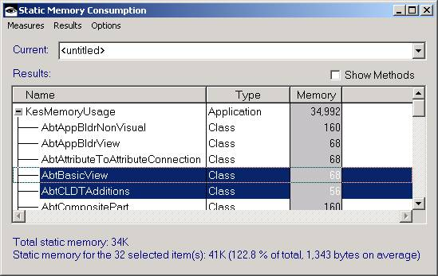
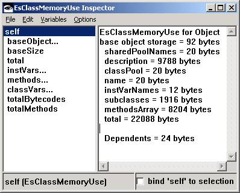
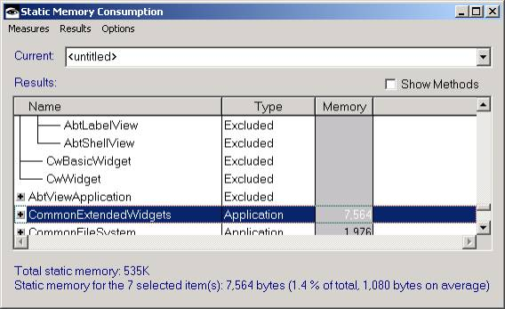

## Introduction
**NOTE:** The following is a cleaned up and reformatted version of the [original article](https://web.archive.org/web/20020302015727/http://www-4.ibm.com/software/ad/smalltalk/discussion/2000/november/ssmc1200.html) by *Dan Kehn* in December 2000 published in the **Eye on Programming** magazine.


# Smalltalk Static Memory Consumption Analysis 
The first part of my “performance series” focused on [dynamic memory analysis](DynamicMemoryAnalysis.md), while this article will focus on static memory analysis. There is obviously less issues to consider, since the nature of the problem is, by definition, less volatile, but there is nonetheless notably reductions in memory usage that can be realized, especially for code generators.

As in the previous installment, an enhancement to the standard IBM ENVY/Stats package, called the _Static Memory Consumption View_, is included.

Studying static memory usage requires a fairly good understanding of the process by which the final executable is produced, namely _packaging_. Thus we’ll cover some of the larger issues surrounding packaging while reviewing some of the more interesting aspects of how to reduce the memory size of Smalltalk code.

## Terminology

These terms will likely be familiar, but just in case, a quick overview of some essential terms.

### Image

An image is a snapshot of the code and objects represented in memory. In general, we’ll talk about either development images or runtime images, the former including the entire Smalltalk environment and its tools, the latter being the result of a packaging step that extracts from the development image the portion that defines the application executable.

This packaging step has as its principle goal the reduction of the development image into a more manageable runtime image. Subsequently, a more accurate name that is used in the documentation for these kinds of images is a _reduced runtime image_.

### Application Prerequisites

Applications are a development organizational entity that defines a collection of classes that together provide a given functionality. Each application must define one or more applications as prerequisites, that is, applications that must be present in order for the current application to load and execute correctly. With the introduction of VisualAge� for Smalltalk version 4.0, the idea of applications was extended to include a technique of dividing the application executable into loadable modules, called _image components_, based on the application definitions and their prerequisites.

The application itself remains both an organizational unit, that is, a way of grouping together related classes, and a class itself. The former is visualized by the VisualAge Organizer, the Application Manager, and various browsers that display the list of applications and the classes they contain. The application class, by contrast, traditionally defines code related to the operation of the application as a whole, for example, directing the initialization of the classes it contains.

### Packaging

Packaging is the process of creating the application executable image. This process is reputed to be difficult, and in fact it is potentially troublesome because it can represent the first point at which a number of errors are detected such as:

* Unimplemented methods that would produce a #doesNotUnderstand: error

* Undefined classes -- or more typically, classes that were defined and later deleted

And by far the most serious:

* Incorrect application prerequisite definitions

The good news is that version 5.0 and beyond includes several new options in the Prerequisites pane of the Application Manager:

* Compute Prerequisites
* Explain Prerequisites
* Explain Mismatched Prerequisites
* Explain Selected Prerequisites

These choices go a long way in clarifying the questions surrounding the meaning of application prerequisites. Now in order to better understand why application prerequisites are so important, let’s review the basic principles behind the packaging process.

## Creating Executables

When packaging, we have to consider two cases: the creation of a classic reduced runtime image, and then an image component.

### Reduced runtime image:
As the name suggests, the goal is to remove unneeded code, represented by either entire classes or a subset of the methods defined within a class. The packager begins by considering the classes defined within the explicitly included applications, then finding what methods are referenced, what classes are referenced by those methods, and so on. Thus a class that is not defined within one of the explicitly included applications of the packager nor one of its prerequisites is immediately eliminated. From the remaining classes, the packager traces from the start-up message (that is, the method that launches the image) to all its referenced methods, classes, etc. The packager’s strategy in this case is to eliminate unreferenced classes and methods from the development image. This approach is effectively by subtraction, that is, the packager considers the entire development image as potentially belonging to the final runtime image, then systematically eliminates portions of it. Since the development image includes instantiated objects, the packager must also consider what objects that represent the state of the image should be included in the runtime image.

### Image component
The packager’s strategy in this case is quite different. Instead of pruning a large tree of dependencies, the approach is additive. That is, the packager effectively begins with an empty image and qualifies what will be added. One of the goals of reusable image components is to be loadable in different contexts, thus they are stateless. So the packager’s job is greatly simplified, since it does not have to consider the state of the development image when packaging. As an added benefit, developers do not have to worry about having a “pristine” image before packaging, since the presence of extraneous instances have no bearing on the packaging process. For example, if a class variable of a class that is being packaged references a collection of objects, they will be included in a reduced runtime image. This is not the case for a reusable image component, where the values of class variables in the development image are ignored.

In both cases, packaging rules can be used to give “hints” to the packager. Such hints can simply signal that a symbol should not be treated as a method selector to avoid an “unimplemented method” packaging warning, or give initialization instructions. The latter is the more interesting to us in the context of this article, since our goal is to minimize the static memory demands of the runtime executable.

Treating all the possible ways to optimize code would be well beyond the scope of this article, so instead let’s focus on two static memory reduction techniques that give a large return for a reasonable effort.

## Code Elimination

The first approach requires more effort and a clear idea of the proper contents of the runtime code. But there are tools that help you find what classes and methods are ripe for removal. First consider the statistics package that comes in the standard ENVY development environment. Load the _KES/Stats_ configuration map, which prerequisites the _ENVY/Stats_ configuration map, and then execute the code below:

```smalltalk
EsMemoryUseReport countApp: KesMemoryUsage.
```

This will generate an example table of memory statistics in the System Transcript:

```
Application: KesMemoryUsage

Application:  KesMemoryUsage

Class                                 Storage   Methods ByteCodes  Literals     Total
-------------------------------------------------------------------------------------
Object                                  22088        17       676       452     23216
KesMemoryConsumptionView                20732        59     10520      3616     34868
Behavior                                15004         2       104         0     15108
AbtBasicView                            12296         1        28         0     12324
CompiledMethod                           7084         2        48         0      7132
ClassDescription                         6488         1        24         0      6512
String                                   4472         1        24         0      4496
KesMemoryConsumptionMeasure              4104        28      1296       648      6048
OrderedCollection                        4048         1        20         0      4068
Number                                   3940         1        40         0      3980
SubApplication                           3324         2        48         0      3372
Collection                               2740         1        52         0      2792
Dictionary                               2708         1        20         0      2728
AbtPart                                  2444         1        28         0      2472
KesClassMemoryConsumptionDelta           2404        23       784        20      3208
KesClassMemoryConsumption                2324        21       660       100      3084
AbtCompositePart                         2268         2        76         0      2344
Date                                     1896         1        40         0      1936
Array                                    1808         1        24         0      1832
KesAnalysisIntervalTester                1748        13       496       172      2416
KesAnalysisTest                          1620        15       404        20      2044
AbtAppBldrNonVisual                      1576         2        76         0      1652
Time                                     1544         2        64         0      1608
AbtAttributeToAttributeConnection        1352         1        28         0      1380
AbtAppBldrView                           1160         1        28         0      1188
AbtDependentsCollection                  1152         1        24         0      1176
KesInstanceCountFilter                    968         6       232        76      1276
KesExcludedObject                         752         6       148         0       900
KesAnalysisBlockTest                      744         5       140        20       904
KesInstances                              692         5       156         0       848
AbtCLDTAdditions                          664         1        20         0       684
KesArray                                  528         3        76         0       604
KesString                                 516         3        76         0       592
KesTime                                   496         3        64         0       560
KesOrderedCollection                      448         2        44         0       492
KesDictionary                             444         2        44         0       488
-------------------------------------------------------------------------------------
Application Total                      138576       237     16632      5124    160332
```


Below is the equivalent data in the Static Memory Consumption view:



Notice that the totals of the two reports are not the same. This is because the view above measures only the classes’ methods, ignoring the memory consumed by the class itself, while the ENVY statistics include **all** overhead data. The difference is perhaps clearer if we inspect a single measurement, for example that of Object, using the code below:

```smalltalk
(EsClassMemoryUse memoryUsedByClass: Object inApp: KesMemoryUsage) inspect
```

This opens the inspector below:



Here we see from where the additional memory is coming: The overhead associated with a class’ instance variables, which hold references to the _methodsArray_, extra instance variables like _description_, etc. Since this overhead cannot typically be reduced by optimization techniques, the Static Memory Consumption view ignores them. So while the ENVY statistics are technically more accurate, I argue that they are less useful in the situations that interest us. Another benefit of the Static Memory Consumption view is the ease by which you can generate subtotals - a simple selection and you get a qualitative feel for the memory consumed by a given item, whether it be an application and all its contained classes, a group of classes spread among several applications, or a single method.

This point is particularly clear when you use the Select… option in conjunction with Exclude to calculate how much savings would be realized by eliminating the selected class(es) or method(s). In other words, you can add the classes that you want to measure by their application, a containing configuration map, or packaging statistics, then play “what if” to decide which approach to code reduction will net the greatest gain. This is particularly interesting for code generators, since the impact of one generation technique versus another can be multiplied many times over, potentially realizing a huge savings.

### Exercises for the reader:

1. Calculate the cost or gain of the changes in the generated code of VisualAge’s #abtBuildInternal and IS_ methods among the different versions (notably between 4.02b and 5.0). What about the overhead of compile-time constants (the code between ##()’s)? Are they worthwhile?

2. See how much additional savings you get by disabling #abtBuildInternals string separation code by modifying the Behavior>>#isAttributeTranslatable: method to always return false. For extra credit, calculate if there is a measurable performance gain for a complex view (e.g., one that includes a notebook with many pages).

Before moving onto the second technique, consider also that the Static Memory Consumption view offers a far more friendly visualization of the packager statistics than the standard classes.es file, which simply lists all the packaged methods. For example, package an application, then choose the Add from packager statistics… option from the Results pulldown menu. It presents a view similar to the one below:



In this case, only those methods that were actually packaged are shown, thus underscoring the effects of the packager’s code reduction algorithm.

### Instance Elimination (Reduced Runtime Images Only)

This second approach is more brutal and generally requires less intimate knowledge of the underlying implementation. It focuses on the careful analysis of the packaging statistics file, spusage.es. This file details all the classes and objects that are included in the runtime image. While the first approach addressed how to reduce the methods’ contribution to static memory, the “space usage” statistics principally addresses what instances are being packaged.

Below is an extraction of `spusage.es` from a trivial “Hello World” application.

```
Output statistics for: myapp.icx

                                       ROM           RAM          Fixed

    Class of Object                 #     Size    #     Size    #     Size

EsByteCodeArray                   5875  290004     0       0
CompiledMethod                   10806  251288     0       0
Array                              352   97712  2126  145524   386   16488
EsMethodArray                        0       0   895  209268
Symbol                            7016  206124     0       0
String                               0       0  4346  196692  2500   67112
ByteArray                            0       0  1341   98932     6     720
Association                          0       0  2422   48440  2041   40820
Metaclass                            0       0   643   38580   643   38580
EsPoolAssociation                    0       0  1851   37020  1785   35700
PlatformFunction                     0       0   893   36464   139    6784
CgFontBitmapEntry                    0       0   901   25228
CgFontName                           0       0  1217   24340
OSLogfont                            0       0  1209   24180
EsCompactBlockContextTemplate        0       0   334   12024   333   11988
CgFontScalableEntry                  0       0   316   11376
CgFontScalable                       0       0   333   10656
OrderedCollection                    0       0   334    8016     1      24
EsLongArray                          0       0     1    4108
EsAtom                             110    2576     0       0
EsAsyncMessageQueue                  0       0     1    2072
OSGuid                               0       0    91    1820
LargeInteger                         0       0    80    1528    52    1024
… etc …
EsEmptyBlock                         1      12     0       0
OSCall                               0       0     1      12
TranscriptTTY                        1      12     0       0

Objects in ROM = 24161   Objects in RAM = 20398   Total objects = 44559
Size of ROM = 847728   Size of RAM = 999208   Total size = 1846936
Fixed objects = 8544   Size of Fixed = 270392
```


In principal, your application’s statistics would be a delta of these statistics, that is, your application simply adds to the instances that are packaged by default. Thus your task is to identify what packaged instances belong to your application and decide if they could be eliminated, because either:

a. They can easily be recreated at runtime via an initialization method, loading from disk, etc.

b. They should never have been packaged, but were included because of a dangling reference.

Concluding that class instances are not needed at runtime clearly requires knowledge of how they are used. But once the decision is made, finding the reason why the instances are included in the package image is fairly straightforward; these techniques are covered in detail in my prior article, [Smalltalk Dynamic Memory Consumption Analysis](DynamicMemoryAnalysis.md). Briefly, an instance is included in the packaged image only if its class is included and there is a hard reference (a global variable or class variable). You can either find what reference is causing an instance to be retained, and should it be a class variable, use the packaging method below:

```smalltalk
    aPackagedImage
        initializeToNilClassVariable: 'X'
            inClassNamed: #MyClass.
```

Or take far less elegant but equally effective approach: Adding an exclusion rule, as shown below:

```smalltalk
aPackagedImage excludeInstancesOfClassNamed:
```


Yet another approach that I recommend is adding your own class method, such as `#xxxPrepareForPackaging`, that you systematically broadcast to all classes before starting to package. These sorts of “cleanliness” methods move the burden of clean up closer to the author of the code, and avoid the natural tendency to delay the task of defining packaging rules until late in the development process. Used in conjunction with the [Memory Consumption Monitor](), it is easy to verify that your “cleanliness” methods do in fact return your image to a pristine state prior to packaging.

The more astute reader may be wondering: Why do the statistics from a simple “Hello World” have so many packaged instances? Does the packager systematically include unneeded base objects in the packaged image?

While the final answer is probably best left to the official VisualAge Smalltalk support staff, my observations would lead me to conclude that there is room for improvement. As an exercise, I trimmed almost 250K off a reduced runtime image simply by adding packaging rules that initialized variables of base classes to nil, since it was clear from reading the code that they would be initialized during image startup.

Below is an example of some of the rules that could be added in the #packagingRulesFor: of the base to eliminate packaged instances (sorry, it is not pretty). I wrote this one afternoon as a test of my assertion that a reduced runtime image can be started with zero (OK, nearly zero) instances because the base code already has all the necessary startup initialization methods to establish the image state. 

_Note:_ the code below is platform and version dependent; so caveat emptor.

```smalltalk
aPackagedImage

 excludeInstancesOfClassNamed: CgWinServer name.
 OSOleInterface flushAll.
 OSOleInterface allSubclasses do: \[:cls | cls guid: nil\].
 EwDragAndDropManager reset.
 APackagedImage
    initializeToNilClassVariable: 'ColorDatabase'
        inClassNamed: CgServer name;
    initializeToNilClassVariable: 'FontCursors'
        inClassNamed: CgServer name;
    initializeToNilClassVariable: 'Default'
        inClassNamed: CgServer name;
    initializeToNilClassVariable: 'Servers'
        inClassNamed: CgServer name;
    initializeToNilClassVariable: 'ButtonIcons'
        inClassNamed: AbtIconHierarchyPolicy name;
    initializeToNilClassVariable: 'TriangleIcons'
        inClassNamed: AbtIconHierarchyPolicy name;
    initializeToNilClassVariable: 'BitmapPath'
        inClassNamed: CgScreen name.

   #('CaptionFont' 'DefaultFont' 'DialogFont' 'EventTable' 
   'GrayColor' 'GrayPen' 'KnownFonts' 'MenuFont' 
   'SmallCaptionFont' 'StatusFont' 'WindowBrush' 'WindowClass' 
   'WindowColor' 'WindowProc') do: [:varName |
      aPackagedImage
        initializeToNilClassVariable: varName
            inClassNamed: OSWidget name].
    
    CwDataInterchangeConverter deregisterAll.
    AbtPrimitiveStringConverter reinitialize.
    aPackagedImage
        initializeToNilClassVariable: 'HandleID'
            inClassNamed: OSEventManager name;
        initializeToNilClassVariable: 'SpareQmsg'
            inClassNamed: OSEventManager name.
    aPackagedImage
        initializeToNilPoolVariable: 'Qmsg'
            inPoolDictionary: #PlatformGlobals.
    CfsStat clearPrivateSharedDiscardableDta.

    "See WindowsPlatformExtensions class>>#initConstants."
    (PlatformConstants keys select: [:key | 'IIDI*' match: key]) 
    do: [:poolVarName |
        aPackagedImage 
            initializeToNilPoolVariable: poolVarName
                inPoolDictionary: #PlatformConstants].
    Object withAllSubclassesDo: [:cls | 
        cls abtPrimFlushInterfaceSpecCache].
```

Sadly, I never did definitively prove my point. I found cases where the instances could not be eliminated simply by adding a packaging rule, so I was satisfied by eliminating around 70% of the “wasted” space.

You may be asking yourself, why all this fuss for a few hundred kilobytes of memory? Well, I’ll save you the pain of reading my ranting about when I worked long ago on a PC/AT with expansion unit \[4\] \-\- and thought that it was hot, hot, hot with 64K of memory -- by only saying “because it’s there”. J

## Conclusion

The burden of memory management is so greatly reduced in VM-based environments that developers are often lulled into complacency, only addressing potential problems when they are painfully obvious to their end-users. Using the memory tools provided with Smalltalk and the extensions included in this article, developers can quickly diagnose and correct memory problems as a part of their quality assurance testing before product shipment.


* * *

\[1\] Copyright IBM Corp. 2000. IBM, VisualAge, and ENVY are trademarks of IBM Corp. in the U.S., other countries, or both. Other company, product, and service names may be trademarks or service marks of others.

\[2\] I have found that certain packaging rules do not produce the same result in a start-up (root) image component and a reusable (leaf) image component, for example :
```smalltalk
#initializeClassVariable:to:inClassNamed:

#initializeClassInstanceVariable:to:inClassNamed: (new to version 4.5)

#replaceMethod:with:inClassNamed:

#excludeMethod:inClassNamed:
```

All the rules worked as expect in a reduced runtime image. Depending on the version, some work in reusable image components, some work in start-up image components, but most fail. Here is a summary of the successes and failures:

| Version | 1. Class Var | 2. Class Inst Var | 3. Replace Mtd | 4. Exclude Mtd | 1. Class Var | 2. Class Inst Var | 3. Replace Mtd | 4. Exclude Mtd |
| --- | --- | --- | --- | --- | --- | --- | --- | --- |
| 4.02b | OK  | n.a., image* | OK  | Fail | OK  | n.a., nil | OK  | OK  |
| 4.5a | Fail, nil | Fail, image* | Fail | Fail | Fail, nil | Fail, nil | OK  | OK  |
| 5.0 | Fail, nil | Fail, image* | Fail | Fail | Fail, nil | Fail, nil | OK  | OK  |

(*) "image" means the value that was in the development image was copied into the packaged IC, otherwise nil was stored

\[3\] In theory, image components are purely stateless, but experience has shown otherwise. See the footnote above.

\[4\] At the time, a PC/AT expansion unit was a clear sign that you were ready for some serious programming.